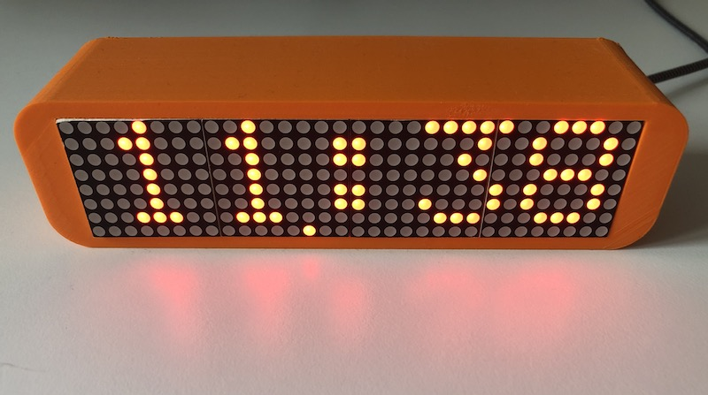
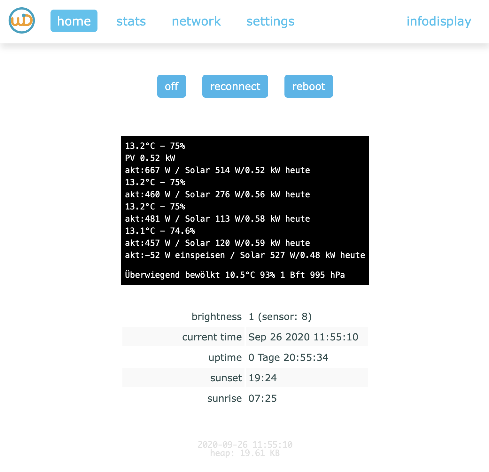
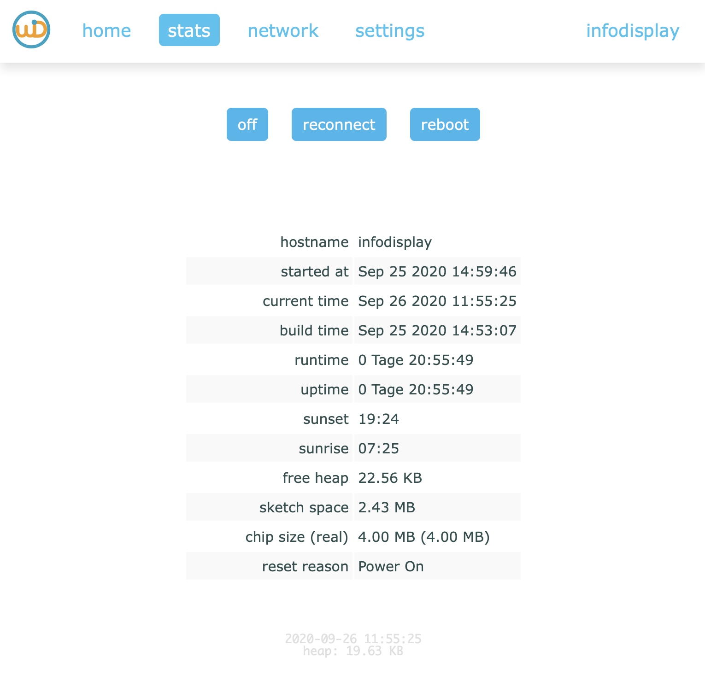
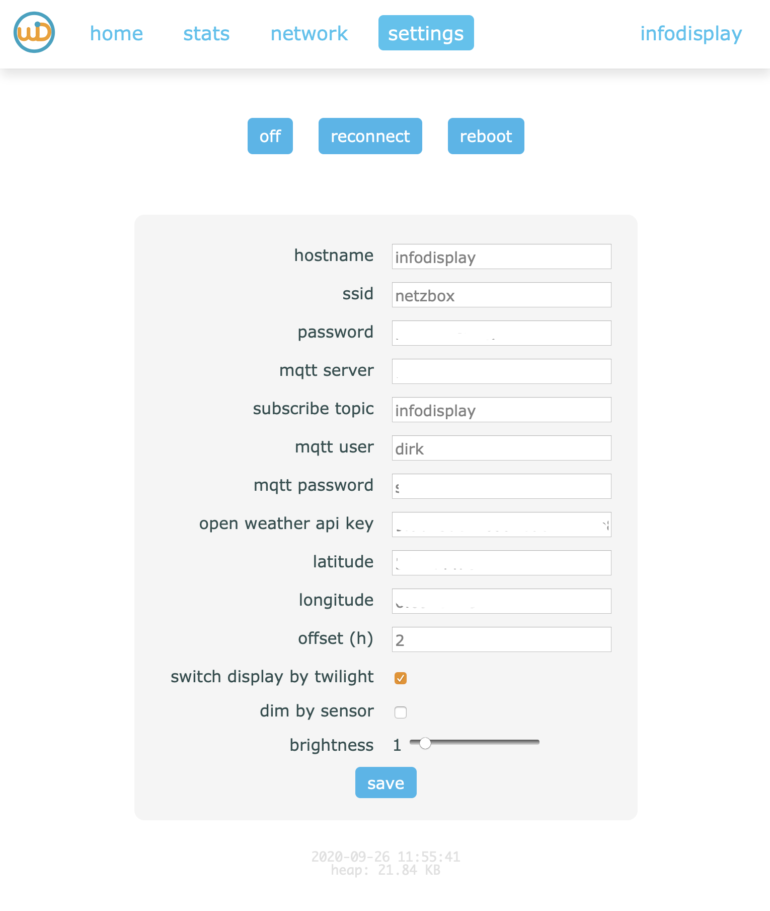

# wifidisplay
eps8266 and max7219 / 8x8 LED based wifi and mqtt display with responsive web UI 

    



## platformio
  check `platformio.ini`  for settings

## Arduino Settings:
    Board:Wemos D1 R2 & mini

## History
    Update: 04.08.2020	// komplette überarbeitung u.a. utf8ascii, ota, mqtt-topics, ...
    Update: 12.09.2020	// neues WebUI inkl. config, settings, ...

## Mosquitto
   ` mosquitto_pub -q 2 -h 192.168.2.222 -u dirk -P **** -t "smarthome/infodisplay/message" -m "test"`

## Required libs
    Max72xxPanel
        --> https://github.com/markruys/arduino-Max72xxPanel
    PubSubClient --> https://pubsubclient.knolleary.net/api
        --> https://github.com/knolleary/pubsubclient/blob/master/examples/mqtt_esp8266/mqtt_esp8266.ino
    Font Customizer:
        --> https://tchapi.github.io/Adafruit-GFX-Font-Customiser/
    ESPAsyncTCP & ESP Async WebServer
        --> https://github.com/me-no-dev/ESPAsyncWebServer
	  Adafruit BusIO & Adafruit GFX Library 
        --> https://github.com/adafruit/Adafruit-GFX-Library
	  ArduinoJson > 6.x
        --> https://arduinojson.org
	  Time > 1.5
        --> https://github.com/PaulStoffregen/Time    

## connecting the DOT Matix

| DOT Matrix | ESP8266 / NodeMCU | 
| ---- |  ----- | 
| VCC    |            5V (VUSB) | 
| GND      |          GND | 
| DIN        |        D7 (GPIO13) | 
| CS           |      D3 (GPIO0) |  
| CLK            |    D5 (GPIO14) | 
| DIM LDR          |  A0 | 

## homebridge configuration
* https://homebridge.io
* https://www.npmjs.com/package/homebridge-http-lightbulb 

```	
{
	"accessory": "HTTP-LIGHTBULB",
	"name": "display",
	"onUrl": "http://192.168.2.102/on",
	"offUrl": "http://192.168.2.102/off",
	"statusUrl": "http://192.168.2.102/state",
	"brightness": {
		"setUrl": "http://192.168.2.102/brightness?value=%s",
		"statusUrl": "http://192.168.2.102/brightness"
	}
}
```    

## housing / 3d print

http://www.thingiverse.com/thing:3154164

## Hints / ideas taken from ...
*   http://esp32-server.de/ntp/
*   https://tttapa.github.io/ESP8266/Chap15%20-%20NTP.html
*   https://github.com/esp8266/Arduino/blob/master/libraries/ESP8266WiFi/examples/NTPClient/NTPClient.ino
*   https://github.com/esp8266/Arduino/blob/master/libraries/esp8266/examples/NTP-TZ-DST/NTP-TZ-DST.ino
*   https://fipsok.de/Esp32-Webserver/ntp-zeit-Esp32.tab
*   http://esp32-server.de/ntp/
*   https://www.electronics-lab.com/project/network-clock-using-esp8266-oled-display/
*   http://forum.arduino.cc/index.php?topic=143903.msg1080948#msg1080948
*   https://github.com/Qrome/marquee-scroller
*   https://www.mikrocontroller.net/attachment/highlight/389184
*   https://forum.mysensors.org/topic/1976/scrolling-text-sensor-node-with-new-v_text/2
*   https://playground.arduino.cc/Main/Utf8ascii/ 
*   https://forum.arduino.cc/index.php?topic=171056.975
*   https://blog.thesen.eu/lokale-uhrzeit-mit-dem-esp8266-und-einem-ntp-zeitserver-inklusive-sommerwinterzeit/
*   https://tttapa.github.io/ESP8266/Chap09%20-%20Web%20Server.html
*   https://ullisroboterseite.de/esp8266-webserver-klasse.html
*   https://git.hacknology.de/wolfgang/CucooLixe/src/branch/master/src/main.cpp
*   https://esp32.com/viewtopic.php?t=9783
*   https://forum.arduino.cc/index.php?topic=484418.0
*   https://github.com/lorol/ESPAsyncWebServer/blob/master/examples/SmartSwitch/SmartSwitch.ino

